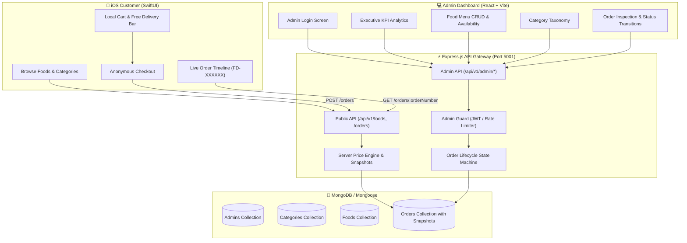

# 🍔 FoodApp — Production Food Delivery Platform

[](https://nodejs.org/)
[](https://expressjs.com/)
[](https://www.mongodb.com/)
[](https://react.dev/)
[](https://developer.apple.com/swift/)
[](LICENSE)

A modern, production-grade **Food Delivery Platform** designed with clean architecture, zero customer authentication friction, strict zero-trust server-side price calculation, an executive React admin portal, and a native Swift/SwiftUI iOS mobile application.

---

## 🌟 Highlights & Key Architecture Decisions

* **100% Anonymous Customer Experience**: No registration forms, no login screens, no customer passwords, and no JWTs for consumers. Customers browse dishes, manage their cart, and checkout seamlessly by simply providing delivery contact details.
* **Zero-Trust Server-Side Price Calculation**: Client-submitted totals, prices, and discounts are never trusted. The backend computes item subtotals, delivery fees, and grand totals directly from current database snapshots within atomic operations.
* **Historical Immutable Snapshots**: `OrderItem` records store permanent snapshots of food names and unit prices at the exact moment of purchase, preserving accounting accuracy even if catalog prices change later.
* **Strict Order Lifecycle State Machine**: Enforces forward status transitions:
  $$\text{PENDING} \longrightarrow \text{CONFIRMED} \longrightarrow \text{PREPARING} \longrightarrow \text{READY} \longrightarrow \text{OUT\_FOR\_DELIVERY} \longrightarrow \text{DELIVERED}$$
* **Zero-Docker Standalone Setup**: The backend features an embedded in-memory MongoDB fallback engine for instant local development and CI testing, while supporting live MongoDB Atlas clusters in production.

---

## 🏛️ System Architecture



---

## 📂 Repository Structure

```text
FoodApp/
├── backend/                     # Node.js Express REST API (ES Modules)
│   ├── src/
│   │   ├── config/              # Environment parser (Zod) & Mongoose connection
│   │   ├── constants/           # HTTP codes & Order status state machine rules
│   │   ├── controllers/         # Thin HTTP handlers
│   │   ├── errors/              # Centralized AppError hierarchy
│   │   ├── middlewares/         # JWT guard, rate limiter, error handler, Zod validator
│   │   ├── models/              # Mongoose schemas (Admin, Category, Food, Order)
│   │   ├── routes/              # Public & Admin route modules
│   │   ├── services/            # Core business logic (Pricing, Orders, Analytics, Auth)
│   │   ├── utils/               # Bcrypt password hashing, JWT signing, Order number generator
│   │   ├── validators/          # Zod validation schemas
│   │   ├── app.js               # Express application initialization
│   │   ├── server.js            # Server bootstrap & graceful shutdown
│   │   └── seed.js              # Database seeder (Admin, Categories, Dishes)
│   └── tests/                   # Jest + Supertest integration test suites
│
├── dashboard/                   # Executive Admin Dashboard (React 18 + Vite)
│   ├── src/
│   │   ├── components/          # Sidebar, Header, StatusBadge, Modal, ProtectedRoute
│   │   ├── context/             # AuthContext (persistent JWT token management)
│   │   ├── pages/               # Overview, Orders, Foods, Categories, Login
│   │   ├── services/            # Fetch API client with authorization interceptor
│   │   └── index.css            # Custom responsive design system
│   └── vite.config.js
│
└── mobile/                      # Native iOS Mobile Application (Swift 6 + SwiftUI)
    ├── FoodApp/
    │   ├── App/                 # FoodApp entry & ContentView TabView host
    │   ├── Core/
    │   │   ├── Networking/      # APIClient, APIEndpoint, APIError, APIResponse
    │   │   ├── Storage/         # CartStore & OrderHistoryStore (UserDefaults)
    │   │   ├── DesignSystem/    # AppTheme, AsyncFoodImage, PrimaryButton, Stepper, StatusPill
    │   │   └── Utilities/       # Currency & Date formatters
    │   ├── Models/              # Codable structs (Category, Food, Order, OrderStatus)
    │   ├── Features/
    │   │   ├── Home/            # HomeView, CategoryFilterChips, FoodCards, HeroBanner
    │   │   ├── FoodDetail/      # FoodDetailView with sticky bottom action bar
    │   │   ├── Search/          # SearchView with real-time text debouncing
    │   │   ├── Cart/            # CartView with free-delivery progress threshold
    │   │   ├── Checkout/        # CheckoutView (anonymous customer delivery form)
    │   │   ├── OrderConfirmation/# OrderConfirmationView with FD-XXXXXX order number
    │   │   └── OrderTracking/   # OrderTrackingView (vertical live timeline) & History
    │   └── Resources/           # Info.plist
    ├── Package.swift            # Swift Package Manager configuration
    └── Tests/                   # Swift XCTest suite
```

---

## 🚀 Quickstart & Setup Guide

### 1. Prerequisites
* **Node.js** v20+ & **npm** v10+
* **Xcode 15+** or **Swift 5.9+** (for macOS / iOS development)

---

### 2. Running the Backend API

```bash
# Navigate to backend
cd backend

# Install dependencies
npm install

# Seed the initial database (Admin, Categories, Dishes)
npm run seed

# Start development server
npm run dev
```

* Backend will run on **`http://localhost:5001`**
* Health check: `http://localhost:5001/api/v1/health`
* Run automated test suites:
  ```bash
  npm test
  ```

---

### 3. Running the Admin Dashboard

```bash
# Navigate to dashboard
cd dashboard

# Install dependencies
npm install

# Start Vite dev server
npm run dev
```

* Dashboard will run on **`http://localhost:5173`**
* **Default Admin Credentials**:
  * **Email**: `admin@fooddelivery.com`
  * **Password**: `Admin@123456`

---

### 4. Running the iOS Application

```bash
# Navigate to mobile
cd mobile

# Run Swift Package Manager unit tests
swift test
```

* Open `mobile/` in **Xcode** or add `mobile/` as a local package / project.
* Select an iOS Simulator (e.g. **iPhone 15 / 16 Pro**) and press **Cmd + R** to run.
* The iOS app automatically connects to `http://localhost:5001/api/v1`.

---

## 📡 REST API Reference

### Public Customer Endpoints (No Authentication)
| Method | Endpoint | Description |
| :--- | :--- | :--- |
| `GET` | `/api/v1/health` | System health check & MongoDB connection status |
| `GET` | `/api/v1/categories` | Retrieve all active meal categories |
| `GET` | `/api/v1/categories/:id` | Retrieve single category details |
| `GET` | `/api/v1/foods` | List foods with search, category, and price filters |
| `GET` | `/api/v1/foods/:id` | Retrieve food details with category metadata |
| `POST` | `/api/v1/orders` | Place anonymous order with server-calculated totals |
| `GET` | `/api/v1/orders/:orderNumber` | Track live order status by public identifier (e.g. `FD-849201`) |

### Protected Admin Endpoints (Requires `Authorization: Bearer <TOKEN>`)
| Method | Endpoint | Description |
| :--- | :--- | :--- |
| `POST` | `/api/v1/admin/auth/login` | Admin login (rate-limited) |
| `POST` | `/api/v1/admin/auth/logout` | Invalidate admin session |
| `GET` | `/api/v1/admin/auth/me` | Fetch authenticated administrator profile |
| `GET` | `/api/v1/admin/dashboard/statistics`| Aggregated metrics, revenue, and order breakdown |
| `GET` | `/api/v1/admin/categories` | List all categories (active & inactive) |
| `POST` | `/api/v1/admin/categories` | Create new category |
| `PATCH`| `/api/v1/admin/categories/:id` | Update category details or display order |
| `DELETE`|`/api/v1/admin/categories/:id`| Safely delete category (enforces no linked foods) |
| `GET` | `/api/v1/admin/foods` | List all foods with pagination |
| `POST` | `/api/v1/admin/foods` | Create new food item |
| `PATCH`| `/api/v1/admin/foods/:id` | Update price, availability, or details |
| `DELETE`|`/api/v1/admin/foods/:id`| Delete food item |
| `GET` | `/api/v1/admin/orders` | List orders with status filters and customer search |
| `GET` | `/api/v1/admin/orders/:id` | Get full order details and item price snapshots |
| `PATCH`| `/api/v1/admin/orders/:id/status`| Transition order along validated state machine |

---

## 🔒 Security Architecture

1. **Zero Customer Data Leakage**: Order lookups use random, non-sequential public order numbers (`FD-XXXXXX`), preventing sequential enumeration attacks.
2. **Admin Protection**: Passwords securely hashed with **bcrypt (12 rounds)**, guarded by strict rate-limiting (`express-rate-limit`) and verified via signed JWTs with expiration.
3. **HTTP Hardening**: Configured with `helmet` for secure response headers and strict CORS filtering.
4. **Input Validation**: All payloads, query params, and IDs validated using **Zod** before hitting controllers.
5. **No Secret Leakage**: Stack traces and internal database schemas are sanitized in production error responses.

---

## 🧪 Automated Testing

| Subsystem | Framework | Coverage |
| :--- | :--- | :--- |
| **Backend API** | Jest & Supertest | Health checks, Admin Auth, Category CRUD & Safe Deletion, Food Catalog & Availability, Zero-Trust Order Pricing, Order Snapshots, State Machine Lifecycle, and Dashboard Analytics (39 automated tests) |
| **Dashboard** | Vite & React Build | Full JSX type checking, CSS asset bundling, and production build verification |
| **Mobile App** | Swift XCTest | CartStore arithmetic, Free delivery progress thresholds, OrderStatus step indices, and APIEndpoint path construction |

To run all automated test suites:
```bash
# 1. Backend tests
cd backend && npm test

# 2. Dashboard build check
cd ../dashboard && npm run build

# 3. Mobile Swift tests
cd ../mobile && swift test
```

---

## 📄 License
This project is licensed under the [MIT License](LICENSE).
